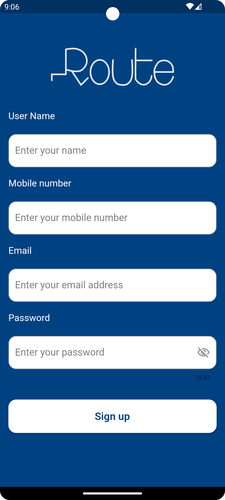
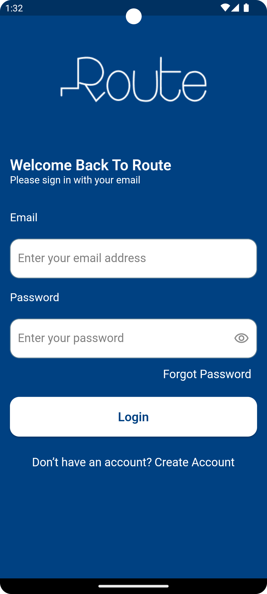
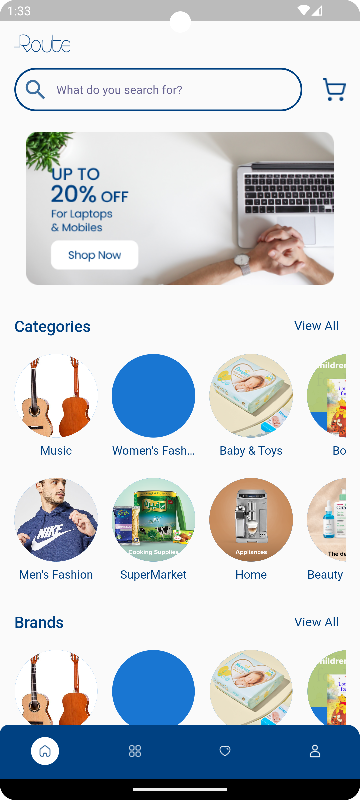
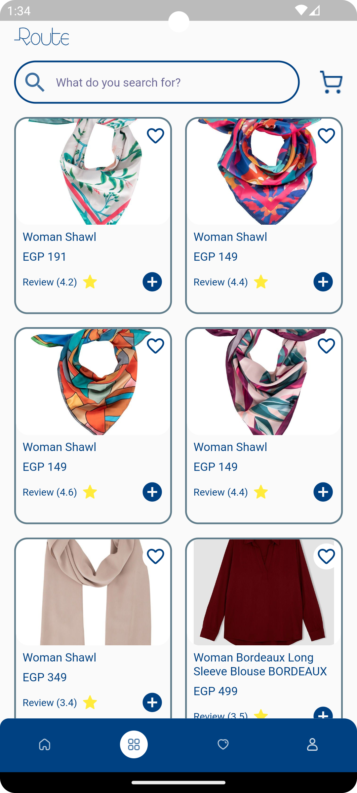
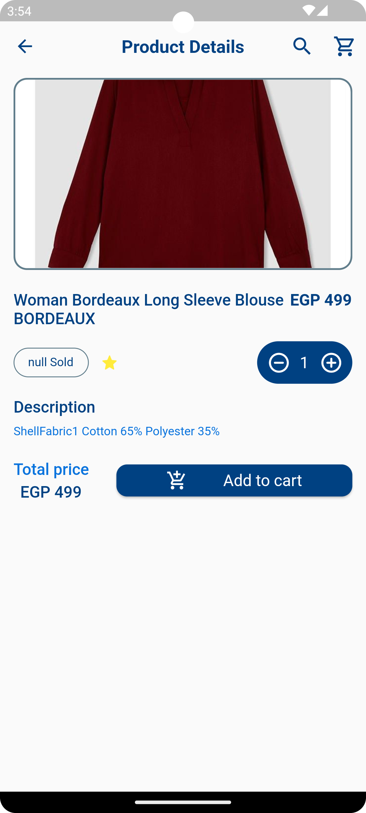
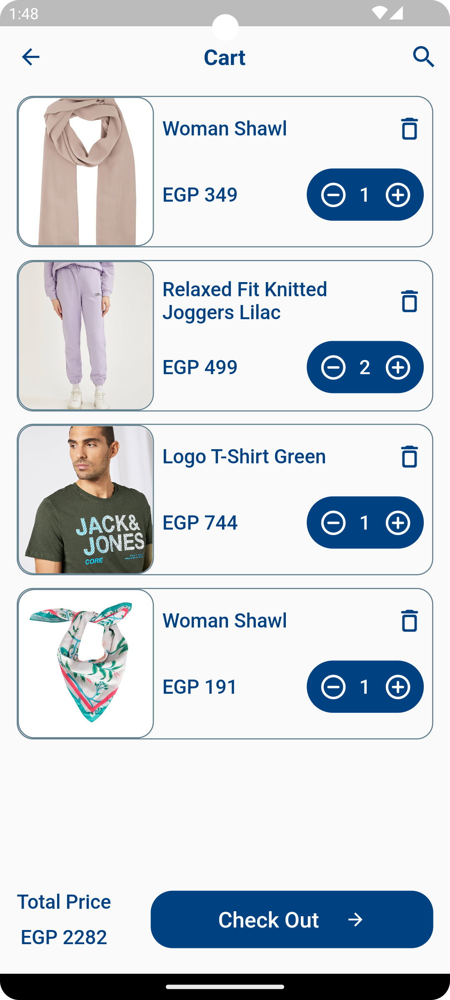
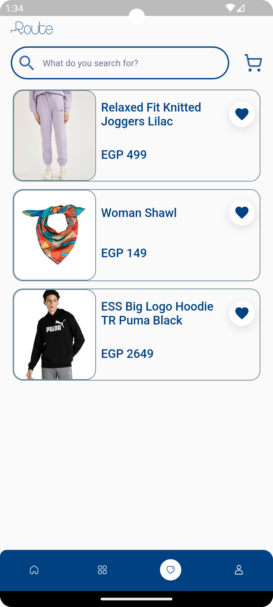
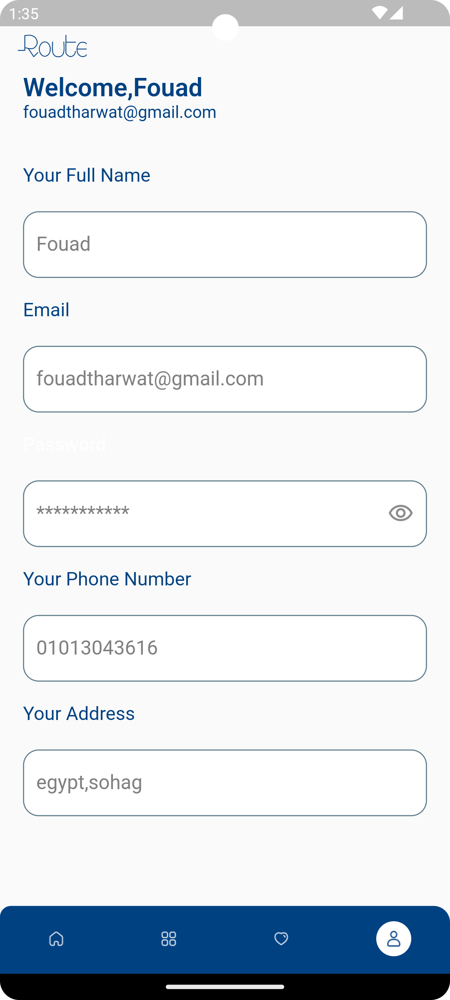

# 🛒 E-Commerce App (Clean Architecture)

A professional E-Commerce application built with **Flutter**, strictly following **Clean Architecture** principles to ensure scalability, maintainability, and clean code standards.

---
## 📸 Screenshots
<p align="center">
  
  
  
  
</p>
<p align="center">
  
  
  
  
  
</p>

---

## 🎥 App Demo
<p align="center">
  <video src="https://github.com/fouadTharwat3616/e_commerce_clean_arch/raw/refs/heads/main/screenshots/Demo5.mp4" width="320" autoplay loop muted playsinline></video>
</p>

---

## 🏗️ Architecture Overview
The project is organized into three main layers:
- **Domain Layer:** Business Logic, Entities, Use Cases, and Repository Interfaces.
- **Data Layer:** Repository Implementations, Models (DTOs), and Data Sources (Remote & Local).
- **Presentation Layer:** State Management using **BLoC/Cubit**, UI Widgets, and Screens.

---

## 🛠️ Tech Stack & Tools
- **State Management:** [Flutter BLoC (Cubit)](https://pub.dev)
- **Dependency Injection:** [GetIt](https://pub.dev) & [Injectable](https://pub.dev)
- **Networking:** [Dio](https://pub.dev) (with Interceptors & Error Handling)
- **Local Storage:** [Shared Preferences](https://pub.dev) for User Caching.
- **UI Scaling:** [Flutter ScreenUtil](https://pub.dev)
- **Code Generation:** [Build Runner](https://pub.dev)

---

## ✨ Key Features
- **User Authentication:** Login & Register with secure **Token Persistence** and User Profile Caching.
- **Product Management:** Browsing Categories, Brands, and Products.
- **Wishlist Logic:** Adding/Removing products with immediate UI feedback and local list management.
- **Cart System:** Complete Cart flow (Add, Remove, Update Quantities) with **Real-time Total Price calculation**.
- **Profile Tab:** Instant access to user data (Name, Email, Phone) retrieved from local storage for a seamless experience.

---

## 🚀 Technical Challenges & Solutions
- **Handling Inconsistent APIs:** Managed inconsistent API response formats (Type Mismatch: String vs Map) at the Data Source level to prevent crashes and ensure data integrity.
- **State Persistence:** Implemented `BlocProvider.value` and **Singletons** to maintain state consistency across Bottom Navigation Tabs, preventing unnecessary reloads.
- **Memory Management:** Properly handled BLoC lifecycles to prevent "emit after close" errors during tab switching.

---

## ⚙️ How to Run
1. **Clone the repository:**
   ```bash
   git clone https://github.com/fouadTharwat3616/e_commerce_clean_arch
2. **Install dependencies:**
   ```bash
   flutter pub get
3. **Generate files (Injectable):**
   ```bash
   dart run build_runner build --delete-conflicting-outputs
4. **Run the app:**
   ```bash
   flutter run

## 👨‍💻 Author
Fouad Tharwat
https://github.com/fouadTharwat3616/e_commerce_clean_arch
